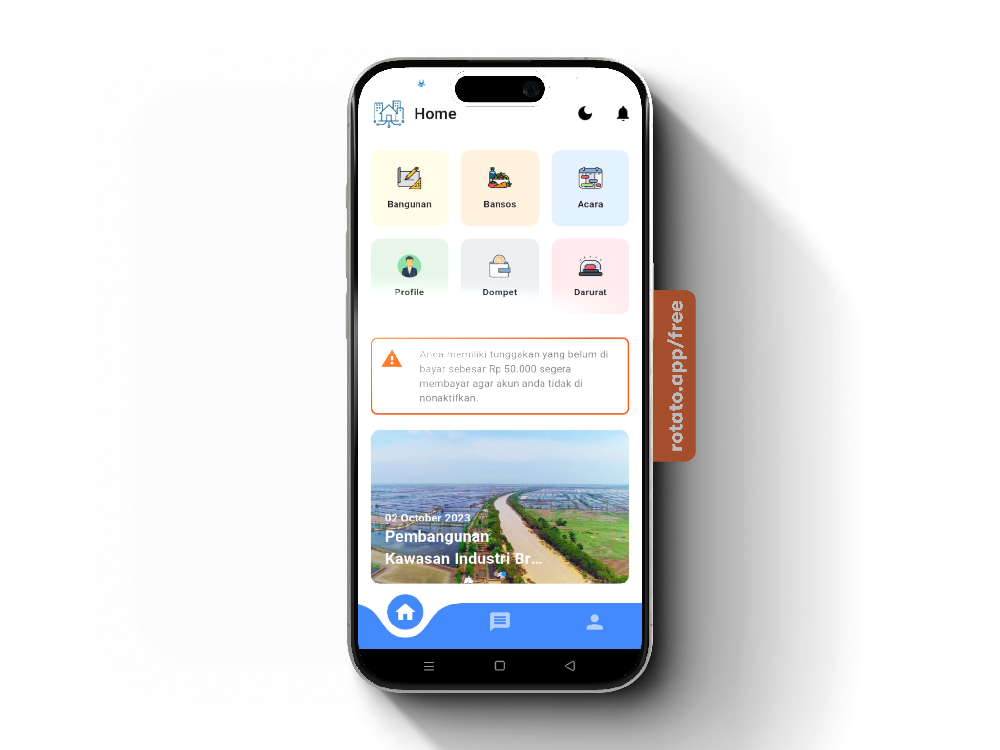

# KAMDIG - Kampung Digital

## ✨ Tentang Aplikasi

**KAMDIG (Kampung Digital)**
adalah aplikasi mobile berbasis Flutter yang mempermudah warga desa dalam mengakses informasi, layanan darurat, berita, dan berbagai kebutuhan komunitas secara digital. Dirancang dengan antarmuka yang ramah pengguna, Kamdig menghubungkan teknologi dengan kebutuhan masyarakat desa.
---

[](video/video1.mp4)

<video width="100%" controls>
  <source src="./video/video1.mp4" type="video/mp4">
  Browser Anda tidak mendukung tag video.
</video>


---

## 📚 Fitur-Fitur Unggulan

### 🏠 Beranda

Berisi akses cepat ke fitur-fitur utama:

* **Bangunan**: Cek kondisi fasilitas umum desa (mushola, jalan, lingkungan, wisata).
* **Bansos**: Informasi penerima bantuan sosial.
* **Acara**: Jadwal acara RT/RW dan notifikasi pengingat otomatis.
* **Dompet**: Dompet digital internal Kamdig untuk transaksi lokal.
* **Darurat**: Tombol SOS untuk bantuan cepat (KDRT, kebakaran, dll).
* **Berita, Bencana, Wisata**: Update berita lokal seputar kejadian dan tempat wisata di desa.

---

## 🔧 Teknologi yang Digunakan

| Teknologi   | Fungsi                                      |
| ----------- | ------------------------------------------- |
| Flutter     | Pengembangan aplikasi mobile                |
| Firebase    | Autentikasi, database, notifikasi           |
| Backend PHP | API server untuk proses dan komunikasi data |
| Brevo       | Layanan email notifikasi dan broadcast info |
| Twilio      | Layanan SMS & panggilan untuk fitur darurat |

---

## 👨‍💻 Tim Pengembang

* 👨‍💻 **Developer**: Chaerul
* 💼 **Owner / Inisiator**: Zaenur Rochis

---

## 📱 Sosial Media

* TikTok: [@chaerulhome21](https://www.tiktok.com/@chaerulhome21)
* Instagram: [@zona.erul](https://www.instagram.com/zona.erul)

---

## 🚀 Instalasi Aplikasi

1. Clone repositori:

   ```bash
   git clone https://github.com/chaerul24/kamdig
   ```
2. Buka di Android Studio / VS Code
3. Jalankan perintah:

   ```bash
   flutter pub get
   flutter run
   ```

---

## 📓 Catatan Tambahan

* Aplikasi masih tahap pengembangan.
* Dompet digital hanya digunakan dalam ekosistem aplikasi Kamdig.

---

**Terima kasih telah menggunakan Kamdig!**
